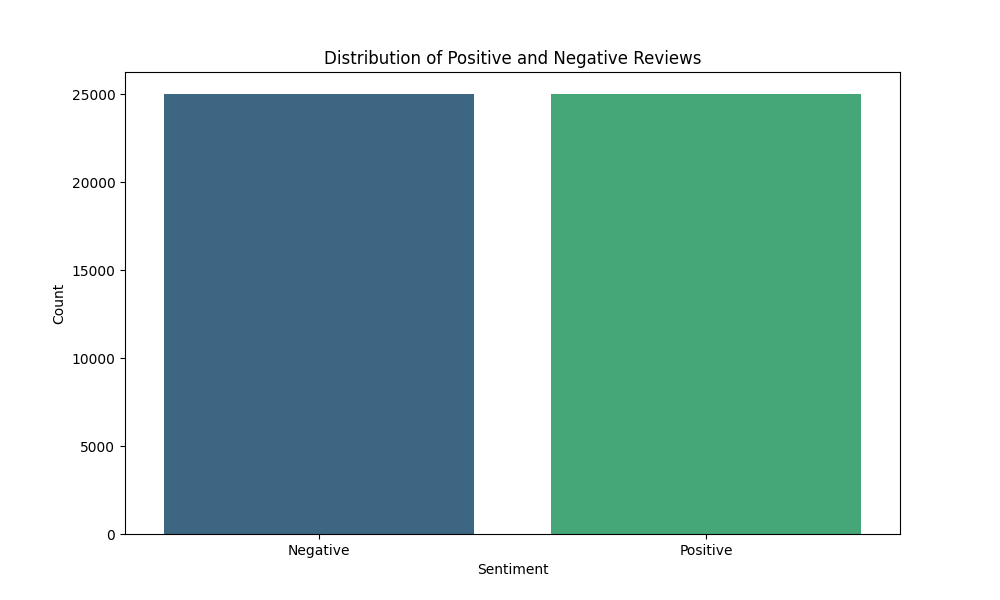
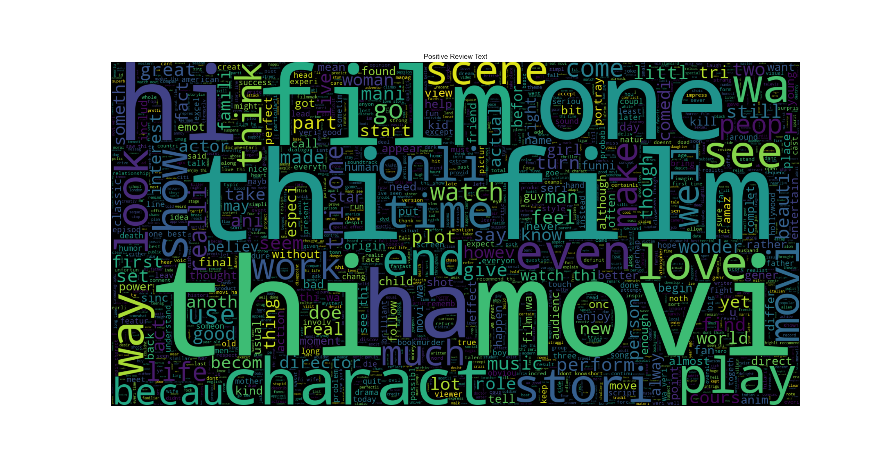
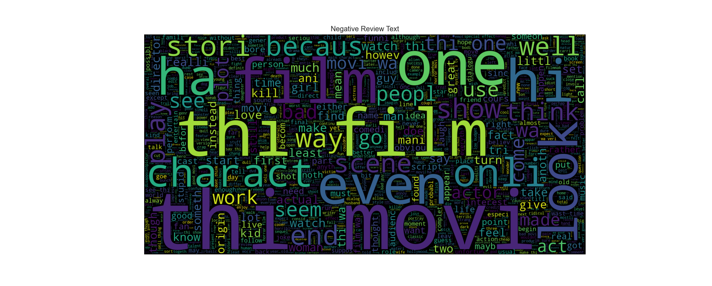
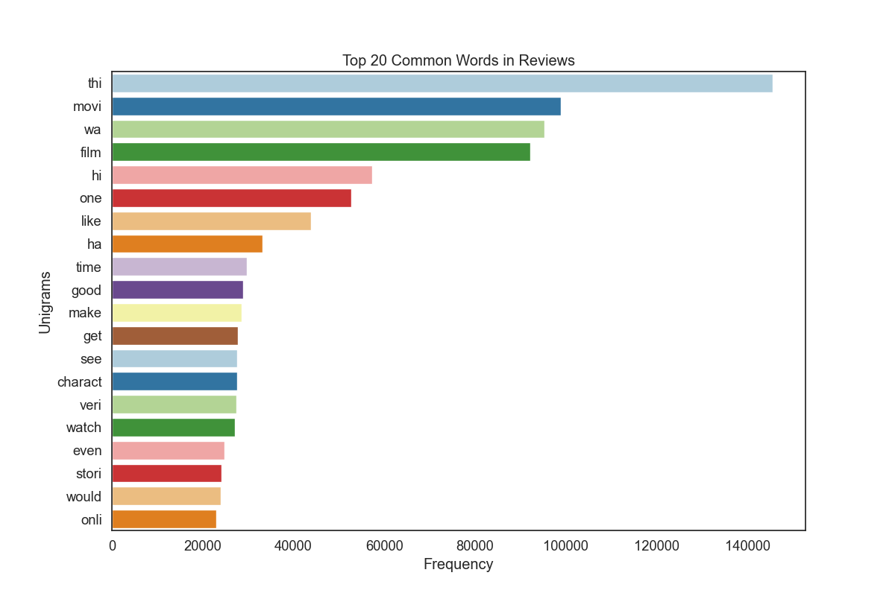

# Sentiment Analysis Project

## Overview
A comprehensive sentiment analysis system that uses both LSTM and BERT models to analyze text sentiment. The project includes text preprocessing, model training, visualization, and a Flask API for predictions.

## Features
- Dual model approach (LSTM and BERT) for robust sentiment analysis
- Text preprocessing pipeline with multiple cleaning steps
- Data visualization tools for sentiment analysis
- RESTful API for real-time predictions
- Ensemble predictions combining both models
- Performance metrics and model comparison

## Project Structure
```
Sentiment Analysis/
├── data_processing.py    # Data loading and preprocessing
├── text_processer.py     # Text cleaning and normalization
├── lstm_model.py         # LSTM model implementation
├── bert_model.py         # BERT model implementation
├── data_visualizer.py    # Visualization tools
├── app.py               # Flask API server
└── models/              # Saved model files
    ├── lstm/
    └── bert/
```

## Requirements
- Python 3.8+
- PyTorch
- Transformers
- TensorFlow
- NLTK
- Flask
- scikit-learn
- pandas
- numpy
- seaborn
- matplotlib
- wordcloud

## Installation
1. Clone the repository:
   ```bash
   git clone <repository-url>
   cd sentiment-analysis
   ```

2. Install dependencies:
   ```bash
   pip install -r requirements.txt
   ```

3. Download NLTK resources:
   ```python
   import nltk
   nltk.download('stopwords')
   nltk.download('punkt')
   nltk.download('wordnet')
   ```

## Running

## Training the models
   ```bash
   python main.py
   ```
### Data Processing code
```python
from data_processing import Data_Processer
from text_processer import Text_Processer

# Initialize processors
data_processor = Data_Processer('files/dataset.csv')
text_processor = Text_Processer()

# Load and process data
data_processor.load_data()
data_processor.preprocess_text(text_processor)
```

### Training Models code
```python
from lstm_model import LSTM_Model
from bert_model import Bert_Model

# Train LSTM model
lstm_model = LSTM_Model(data_processor.data_loader)
lstm_model.train_model()

# Train BERT model
bert_model = Bert_Model(data_processor.data_loader)
bert_model.train_model()
```

### Running the API Server
1. Start the Flask server:
   ```bash
   python app.py
   ```

## API Endpoints

### POST /predict

Analyzes the sentiment of provided text using both models.

Curl:
```bash
    curl --location 'http://localhost:5000/predict' \
    --header 'Content-Type: application/json' \
    --data '{
        "text": "This movie was absolutely fantastic! The acting was superb and the plot kept me engaged throughout."}'
```

Request body:
```json
{
    "text": "This movie was absolutely fantastic! The acting was superb and the plot kept me engaged throughout."
}
```

Response includes:
- LSTM model prediction
- BERT model prediction
- Ensemble prediction
- Model comparison metrics


### GET /health
Checks the health status of the API and models.

Curl:
   ```bash
   curl --location 'http://localhost:5000/health'
   ```


# Visualization
```python
from data_visualizer import Data_Visualizer

visualizer = Data_Visualizer(processed_data)
visualizer.sentiment_distribution()
visualizer.wordcloud_positive()
visualizer.wordcloud_negative()
```
## 1. Sentiment Distribution
The distribution of sentiment labels across the dataset.



## 2. Word Clouds

### Positive Reviews Word Cloud
Most frequent words in positive movie reviews.



### Negative Reviews Word Cloud
Most frequent words in negative movie reviews.



## 3. Most Common Words (Unigrams)
Top words used across all reviews.




# Model Performance
Both LSTM and BERT models are evaluated using:
- Accuracy
- Precision
- Recall
- F1 Score

Metrics are saved in `models/lstm/metrics.json` and `models/bert/metrics.json`.

### BERT Model Results
- Accuracy: 87.15%
- Precision: 86.99%
- Recall: 87.59%
- F1 Score: 87.29%


### LSTM Model Results
- Accuracy: 84.25%
- Precision: 85.20%
- Recall: 83.19%
- F1 Score: 84.18%


