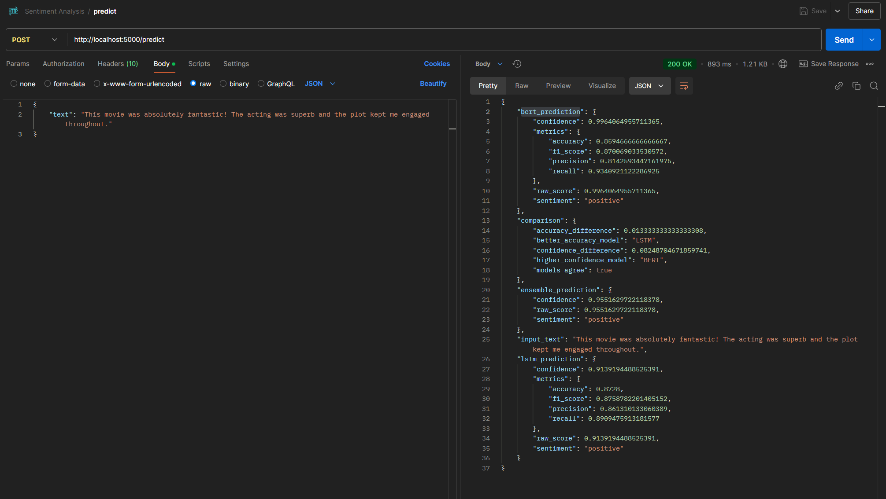
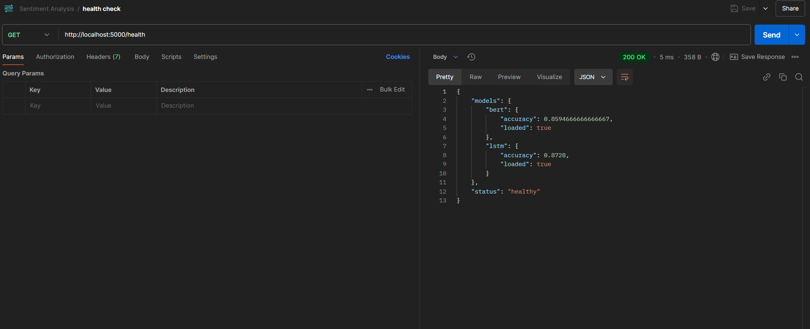
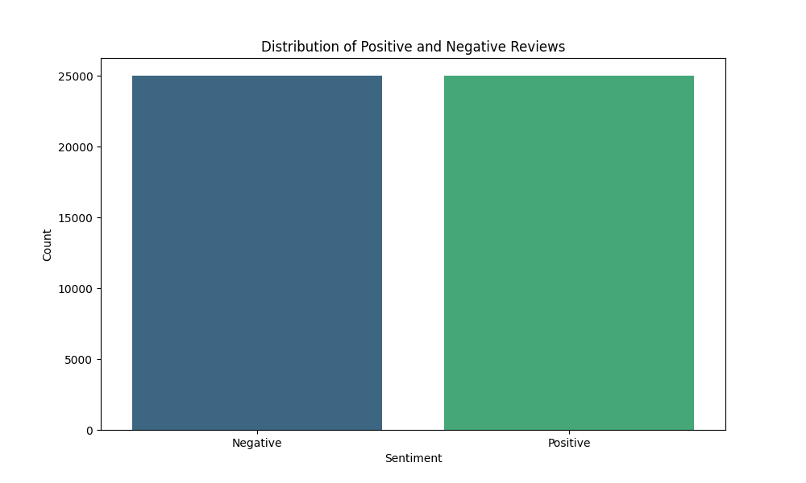
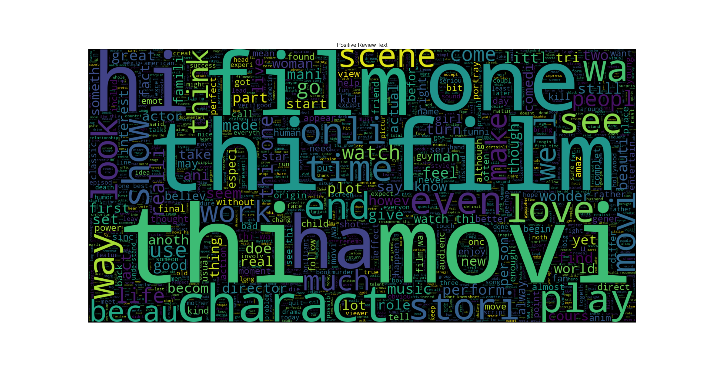
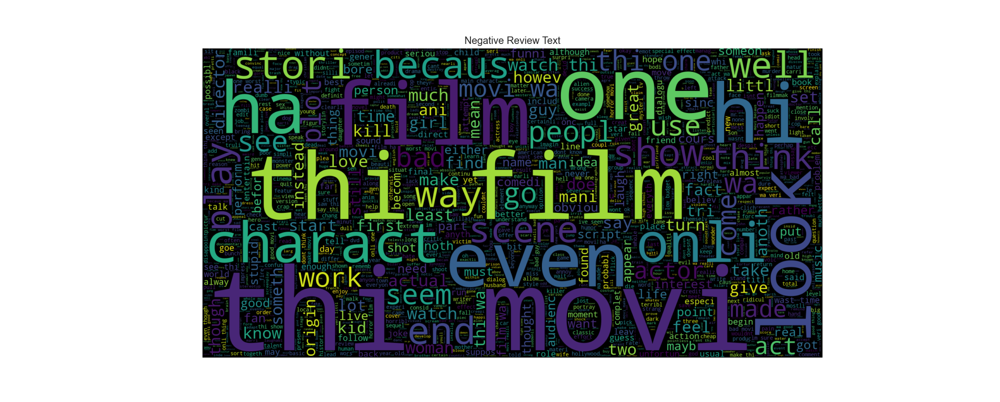
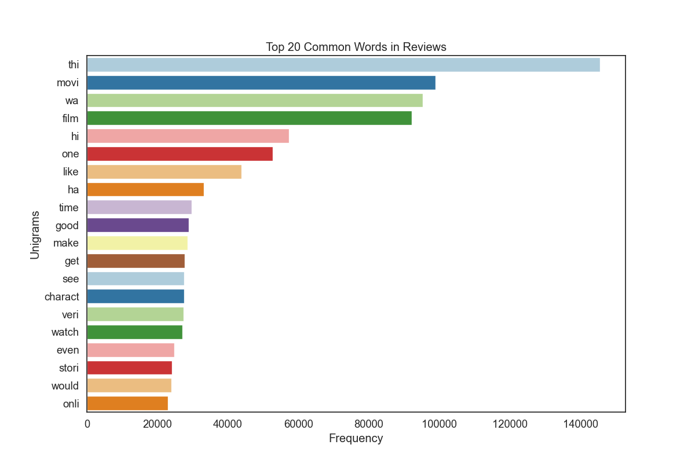
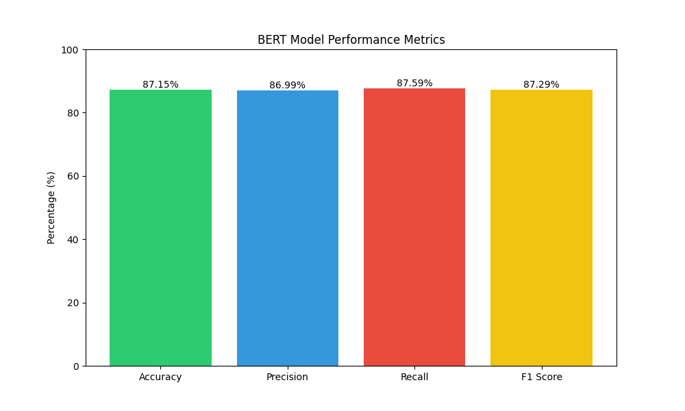
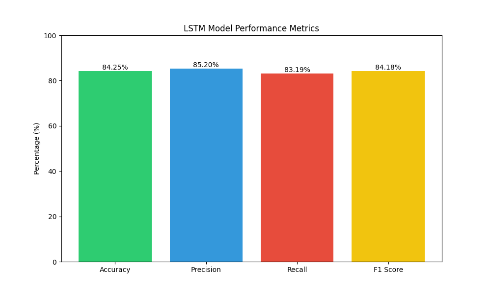

# Sentiment Analysis Project

## Overview
A comprehensive sentiment analysis system that uses both LSTM and BERT models to analyze text sentiment. The project includes text preprocessing, model training, visualization, and a Flask API for predictions.

## Features
- Dual model approach (LSTM and BERT) for robust sentiment analysis
- Text preprocessing pipeline with multiple cleaning steps
- Data visualization tools for sentiment analysis
- RESTful API for real-time predictions
- Ensemble predictions combining both models
- Performance metrics and model comparison

## Project Structure
```
Sentiment Analysis/
├── data_processing.py    # Data loading and preprocessing
├── text_processer.py     # Text cleaning and normalization
├── lstm_model.py         # LSTM model implementation
├── bert_model.py         # BERT model implementation
├── data_visualizer.py    # Visualization tools
├── app.py               # Flask API server
└── models/              # Saved model files
    ├── lstm/
    └── bert/
```

## Requirements
- Python 3.8+
- PyTorch
- Transformers
- TensorFlow
- NLTK
- Flask
- scikit-learn
- pandas
- numpy
- seaborn
- matplotlib
- wordcloud

## Installation
1. Clone the repository:
   ```bash
   git clone <repository-url>
   cd sentiment-analysis
   ```

2. Install dependencies:
   ```bash
   pip install -r requirements.txt
   ```

3. Download NLTK resources:
   ```python
   import nltk
   nltk.download('stopwords')
   nltk.download('punkt')
   nltk.download('wordnet')
   ```

## Running

## Training the models
   ```bash
   python main.py
   ```
### Data Processing code
```python
from data_processing import Data_Processer
from text_processer import Text_Processer

# Initialize processors
data_processor = Data_Processer('files/dataset.csv')
text_processor = Text_Processer()

# Load and process data
data_processor.load_data()
data_processor.preprocess_text(text_processor)
```

### Training Models code
```python
from lstm_model import LSTM_Model
from bert_model import Bert_Model

# Train LSTM model
lstm_model = LSTM_Model(data_processor.data_loader)
lstm_model.train_model()

# Train BERT model
bert_model = Bert_Model(data_processor.data_loader)
bert_model.train_model()
```


### Running the API Server
1. Start the Flask server:
   ```bash
   python app.py
   ```

## API Endpoints

### POST /predict

Analyzes the sentiment of provided text using both models.

Curl:
```bash
    curl --location 'http://localhost:5000/predict' \
    --header 'Content-Type: application/json' \
    --data '{
        "text": "This movie was absolutely fantastic! The acting was superb and the plot kept me engaged throughout."}'
```

Request body:
```json
{
    "text": "This movie was absolutely fantastic! The acting was superb and the plot kept me engaged throughout."
}
```

Response includes:
- LSTM model prediction
- BERT model prediction
- Ensemble prediction
- Model comparison metrics



### GET /health
Checks the health status of the API and models.

Curl:
   ```bash
   curl --location 'http://localhost:5000/health'
   ```



# Visualization
```python
from data_visualizer import Data_Visualizer

visualizer = Data_Visualizer(processed_data)
visualizer.sentiment_distribution()
visualizer.wordcloud_positive()
visualizer.wordcloud_negative()
```
## 1. Sentiment Distribution
The distribution of sentiment labels across the dataset.



## 2. Word Clouds

### Positive Reviews Word Cloud
Most frequent words in positive movie reviews.



### Negative Reviews Word Cloud
Most frequent words in negative movie reviews.



## 3. Most Common Words (Unigrams)
Top words used across all reviews.




# Model Performance
Both LSTM and BERT models are evaluated using:
- Accuracy
- Precision
- Recall
- F1 Score

Metrics are saved in `models/lstm/metrics.json` and `models/bert/metrics.json`.

### BERT Model Results
- Accuracy: 87.15%
- Precision: 86.99%
- Recall: 87.59%
- F1 Score: 87.29%



### LSTM Model Results
- Accuracy: 84.25%
- Precision: 85.20%
- Recall: 83.19%
- F1 Score: 84.18%



## Data Process and Training Logs
   ```Text
      Data loaded successfully!
      
      First few rows of the dataset:
                                                    review sentiment
      0  One of the other reviewers has mentioned that ...  positive
      1  A wonderful little production. <br /><br />The...  positive
      2  I thought this was a wonderful way to spend ti...  positive
      3  Basically there's a family where a little boy ...  negative
      4  Petter Mattei's "Love in the Time of Money" is...  positive
      
      Dataset info:
      <class 'pandas.core.frame.DataFrame'>
      RangeIndex: 50000 entries, 0 to 49999
      Data columns (total 2 columns):
       #   Column     Non-Null Count  Dtype
      ---  ------     --------------  -----
       0   review     50000 non-null  object
       1   sentiment  50000 non-null  object
      dtypes: object(2)
      memory usage: 781.4+ KB
      None
      
      Describe the dataset:
                                                         review sentiment
      count                                               50000     50000
      unique                                              49582         2
      top     Loved today'  s show!!! It was a variety and not...  positive
      freq                                                    5     25000
      
      Checking for the missing values:
      review       0
      sentiment    0
      dtype: int64
      Processing reviews:   0%|          | 0/50000 [00:00<?, ?it/s]Labels converted to binary.
      Processing reviews: 100%|██████████| 50000/50000 [01:33<00:00, 532.62it/s]
      Reviews preprocessed.
      Initialized BERT model class
      Starting BERT model training
      Using device: cuda
      Loading data splits...
      Data splits loaded successfully
      BERT tokenizer loaded
      Tokenizing 35000 texts
      Tokenizing: 100%|██████████| 35000/35000 [00:40<00:00, 868.06it/s]
      Tokenization completed
      Tokenizing 7500 texts
      Tokenizing: 100%|██████████| 7500/7500 [00:08<00:00, 864.12it/s]
      Tokenization completed
      Tokenizing 7500 texts
      Tokenizing: 100%|██████████| 7500/7500 [00:08<00:00, 858.62it/s]
      Tokenization completed
      DataLoaders created successfully
      Loading BERT model...
      BERT model loaded successfully
      Some weights of BertForSequenceClassification were not initialized from the model checkpoint at bert-base-uncased and are newly initialized: ['classifier.bias', 'classifier.weight']
      You should probably TRAIN this model on a down-stream task to be able to use it for predictions and inference.
      Training:   0%|          | 0/2187 [00:00<?, ?it/s]Starting fine-tuning for 3 epochs
      Starting epoch 1/3
      Training: 100%|██████████| 2187/2187 [05:26<00:00,  6.70it/s]
      Validation:   0%|          | 0/469 [00:00<?, ?it/s]Average training loss: 0.3974
      Validation: 100%|██████████| 469/469 [00:21<00:00, 21.35it/s]
      Validation Accuracy: 0.8625
      Training:   0%|          | 0/2187 [00:00<?, ?it/s]New best model saved with accuracy: 0.8625
      Starting epoch 2/3
      Training: 100%|██████████| 2187/2187 [05:10<00:00,  7.05it/s]
      Average training loss: 0.2697
      Validation: 100%|██████████| 469/469 [00:21<00:00, 21.74it/s]
      Training:   0%|          | 0/2187 [00:00<?, ?it/s]Validation Accuracy: 0.8555
      Starting epoch 3/3
      Training: 100%|██████████| 2187/2187 [05:08<00:00,  7.10it/s]
      Average training loss: 0.1969
      Validation: 100%|██████████| 469/469 [00:20<00:00, 22.36it/s]
      Validation Accuracy: 0.8700
      New best model saved with accuracy: 0.8700
      Testing:   0%|          | 0/469 [00:00<?, ?it/s]Tokenizer saved successfully
      Starting model evaluation
      Testing: 100%|██████████| 469/469 [00:20<00:00, 22.50it/s]
      Evaluation completed
      Calculating metrics
      Test Metrics: {'accuracy': 0.8714666666666666, 'precision': 0.8698738170347003, 'recall': 0.8758602435150874, 'f1_score': 0.8728567660247956}
      Training completed successfully
      Initialized LSTM model class
      Starting LSTM model training
      Using device: cuda
      Data splits loaded successfully
      Tokenizer built
      Tokenizing 35000 texts
      Tokenizing: 100%|██████████| 35000/35000 [00:00<00:00, 38676.85it/s]
      Tokenization completed
      Tokenizing 7500 texts
      Tokenizing: 100%|██████████| 7500/7500 [00:00<00:00, 42613.72it/s]
      Tokenizing:   0%|          | 0/7500 [00:00<?, ?it/s]Tokenization completed
      Tokenizing 7500 texts
      Tokenizing: 100%|██████████| 7500/7500 [00:00<00:00, 43103.44it/s]
      Tokenization completed
      DataLoaders created successfully
      Loading LSTM model...
      LSTM model loaded successfully
      Starting fine-tuning for 3 epochs
      Starting epoch 1/3
      Training: 100%|██████████| 2187/2187 [00:16<00:00, 128.65it/s]
      Validation:   0%|          | 0/469 [00:00<?, ?it/s]Average training loss: 0.6714
      Validation: 100%|██████████| 469/469 [00:04<00:00, 103.80it/s]
      Validation Accuracy: 0.7037
      New best model saved with accuracy: 0.7037
      Starting epoch 2/3
      Training: 100%|██████████| 2187/2187 [00:17<00:00, 127.86it/s]
      Average training loss: 0.5065
      Validation: 100%|██████████| 469/469 [00:04<00:00, 102.89it/s]
      Validation Accuracy: 0.8051
      New best model saved with accuracy: 0.8051
      Starting epoch 3/3
      Training: 100%|██████████| 2187/2187 [00:17<00:00, 127.25it/s]
      Average training loss: 0.3522
      Validation: 100%|██████████| 469/469 [00:04<00:00, 101.94it/s]
      Validation Accuracy: 0.8431
      New best model saved with accuracy: 0.8431
      Testing:   0%|          | 0/469 [00:00<?, ?it/s]Starting model evaluation
      Testing: 100%|██████████| 469/469 [00:04<00:00, 103.90it/s]
      Evaluation completed
      Calculating metrics
      Test Metrics: {'accuracy': 0.8425333333333334, 'precision': 0.8519924098671727, 'recall': 0.831921651667549, 'f1_score': 0.841837417972412}
      Training completed successfully
      
      Process finished with exit code 0
   ```


